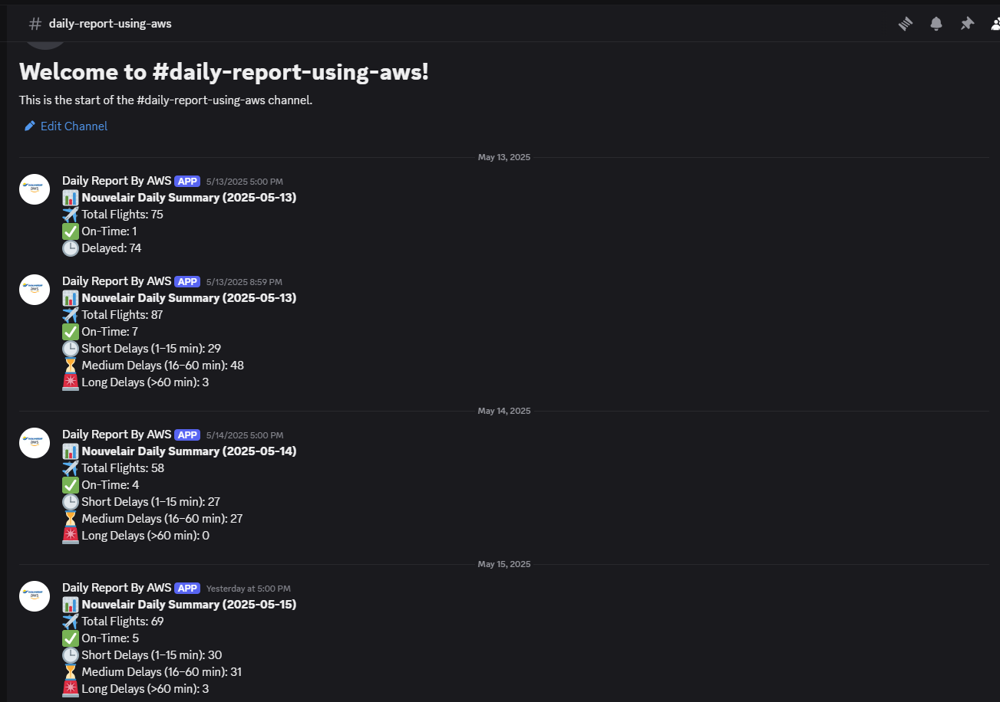
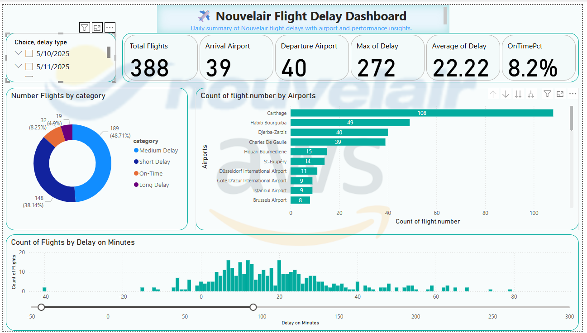

# ✈️ Nouvelair Flight Delay Analytics (AWS + Power BI Version)

This project is a fully automated and serverless analytics system that collects and visualizes daily Nouvelair flight delay data. It combines AWS Lambda for scheduled API execution, S3 for cloud storage, Python for data handling, Power BI for interactive dashboards, and Discord for sharing daily reports automatically.

> 🔎 This is an enhanced version of my previous project: [Nouvelair Delay Watch](https://github.com/AmirAmemi/nouvelair-delay-watch)

---

## 🌐 Live Report on Discord

Daily summaries are automatically posted here:
**🔗 **[**Check the Discord Channel**](https://discord.gg/NjhaeBWCMJ)



### 📊 Sample Daily Report Screenshot

---

## 🚀 Project Architecture

```
graph TD
    A[Aviationstack API] -->|Daily Trigger| B[AWS Lambda Function]
    B --> C[S3 Bucket (nouvelairdata/raw)]
    C --> D[Python Script (sync_to_local.py)]
    D --> E[Local Folder (local_data)]
    E --> F[Power BI Dashboard]
    F --> G[Interactive Reports + KPIs]
    B --> H[Discord Webhook Report]
```

---

## 💡 Features

* ⏰ **Automated Lambda Trigger** (daily at 17:00 CET)
* ☁️ **S3 JSON Storage** (organized by date)
* 📂 **Local Data Sync** using Python & boto3
* 📊 **Dynamic Power BI Dashboard** connected to synced folder
* 📢 **Daily Discord Posts** summarizing delay stats

---

## 🎓 Dashboard Overview (Power BI)



### Main Metrics:

* 🔢 Total Flights
* ✅ On-Time %
* ⏳ Delay Breakdown (Short / Medium / Long)
* 🌍 Flights by Departure/Arrival Airports
* ⌚ Delay in Minutes (Histogram)
* Ὄ5 Filter by Date + Category

---

## 🔧 Technologies Used

| Stack         | Tool                               |
| ------------- | ---------------------------------- |
| Cloud         | AWS Lambda, S3                     |
| Data Sync     | Python, Boto3                      |
| Visualization | Power BI (Desktop)                 |
| API           | Aviationstack API                  |
| Automation    | SAM CLI, Task Scheduler (optional) |
| Notification  | Discord Webhook                    |


---


## 🔄 Update Schedule

* Lambda runs daily at **17:00 (CET)**
* Sync to local happens manually or via automation
* Power BI refreshes with latest JSON
* Discord message sent with latest delay summary

---

## 📑 Previous Version

* GitHub: [Nouvelair Delay Watch](https://github.com/AmirAmemi/nouvelair-delay-watch)
* Discord: [Channel](https://discord.com/invite/n2vmB4Yshk)
* LinkedIn: [POST](https://www.linkedin.com/posts/amemi-amir_dataengineering-python-etl-activity-7322892546186072064-lDqs?utm_source=share&utm_medium=member_desktop&rcm=ACoAAC3q3tsBDcsEo6yyUNSAgIGyiAMk6zlCqy0)
* This version improves it by using **AWS infrastructure** and **dashboard automation**

---

## 📄 Folder Structure

```
Nouvelair-Delay-AWS/
├── fetch_flights/           # Lambda function code
├── template.yaml            # SAM template
├── sync_to_local.py         # S3 to local sync script
├── local_data/              # Synced JSON files
├── assets/                  # Dashboard and Discord screenshots
└── README.md
```

---

## 🙋 Contact Me

* 🔗 [LinkedIn](https://www.linkedin.com/in/amemi-amir/)
* 💼 [Portfolio](https://www.amemi.de/)
* 📧 Email: [amir@amemi.de](https://github.com/AmirAmemi/nouvelair-delay-watch/blob/main/amir@amemi.de)

Feel free to connect, collaborate, or suggest improvements!

---


## 🏆 Credits

Created and maintained by **@AmirAmemi**
Reach out via [GitHub](https://github.com/AmirAmemi) or join the [Discord Server](https://discord.gg/NjhaeBWCMJ) for questions or feedback.
